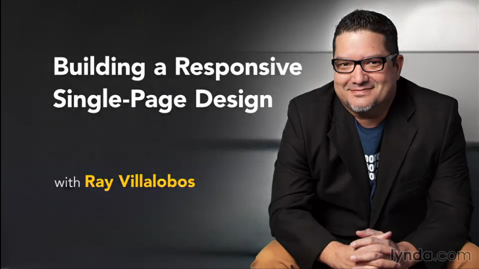

# Building a Responsive Single-Page Design

This is the repository for my course, [Building a Responsive Single-Page Design](http://www.lynda.com/CSS-tutorials/Building-Responsive-Single-Page-Design/182174-2.html). The full course is available at [lynda.com](http://lynda.com).

## Course Description
Learn how to build dynamic, responsive single-page designs with HTML, JavaScript, and CSS. The website featured in this course combines docking navigation, columns that adjust without cluttering your site layout or HTML markup, and animated scrolling effects that respond to user direction. Author Ray Villalobos shows you how to build it. He starts with a lean, easy-to-read template, and then explains how to add the features that make single-page designs so great, with these four frameworks:
Compass, whose Sass mixins help you leverage CSS3 features like Flexbox
Susy 2, the framework that "subtracts" the math from responsive grid design
ScrollMagic, for adding "magical" scroll effects
Breakpoint, which makes writing media queries in Sass a snap

But this course isn't just about the tools. It's a realistic project that epitomizes many of the design challenges website developers face in the real world. Start watching now and learn how to use HTML, jQuery, and CSS to build your own dynamic, deeply responsive designs.

## Topics include:
- Analyzing the project before you begin
- Creating basic styles
- Building your own Sass mixins
- Coding the navigation
- Making the navigation responsive, with grids
- Using a split layout
- Creating tween animations
- Controlling scenes with scrolling

## Instructions
This repository has branches for each of the videos in the course. You can use the branch pop up menu in github to switch to a specific branch and take a look at the course at that stage. Or you can simply add `/tree/BRANCH_NAME` to the URL to go to the branch you want to peek at.

1. Make sure you have these installed
	- [node.js](http://nodejs.org/)
	- [git](http://git-scm.com/)
	- [gulp](http://gulpjs.com/)
2. Clone this repository into your local machine using the terminal (mac) or Gitbash (PC) `> git clone https://github.com/planetoftheweb/attendance.git`
3. CD to the folder `cd responsive`
4. Run `> npm-install` to install the project dependencies
5. Install gulp.js via the Mac terminal or Gitbash on a PC `> npm install -g gulp`
5. Run the Gulp command `> gulp`
6. Fire up your browser at `http://localhost:8080`

For more help setting up a comprehensive Gulp.js workflow, check out [Web Project Workflows with Gulp.js, Git, and Browserify](http://www.lynda.com/Web-Web-Design-tutorials/Web-Project-Workflows-Gulpjs-Git-Browserify/154416-2.html).

## More Stuff
Check out some of my [other courses on lynda.com](http://lynda.com/rayvillalobos). You can also check out my [youtube channel](http://youtube.com/planetoftheweb), [follow me on twitter](http://twitter.com/planetoftheweb), or read [my blog](http://raybo.org).
